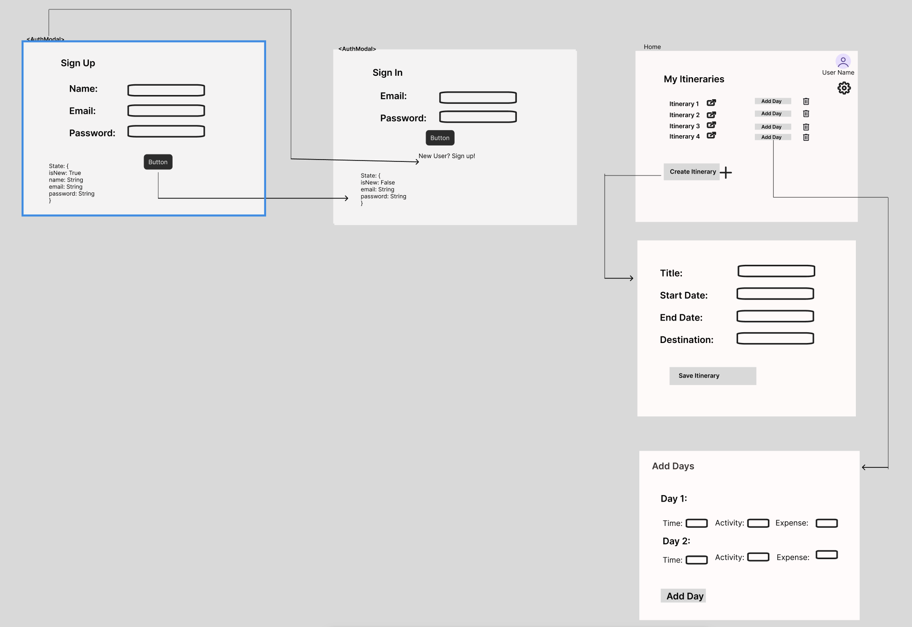
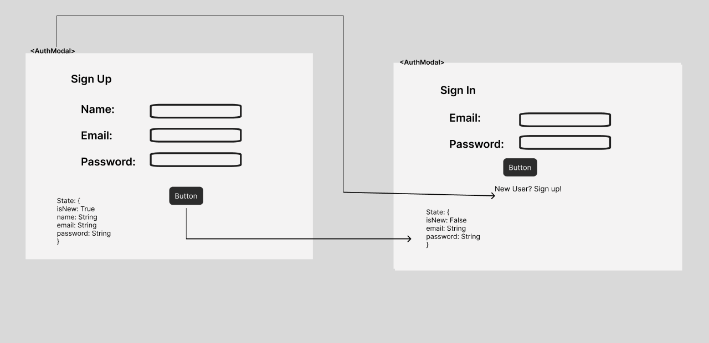
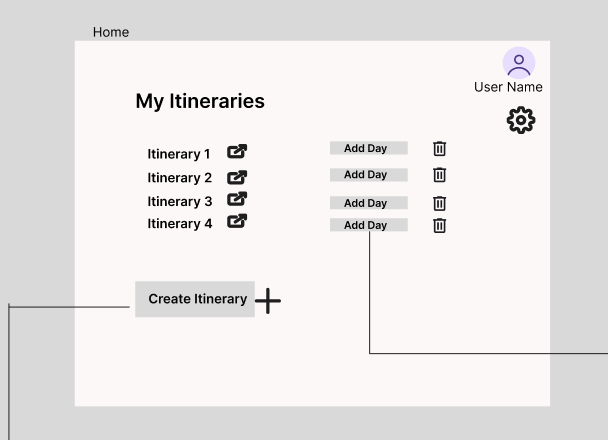
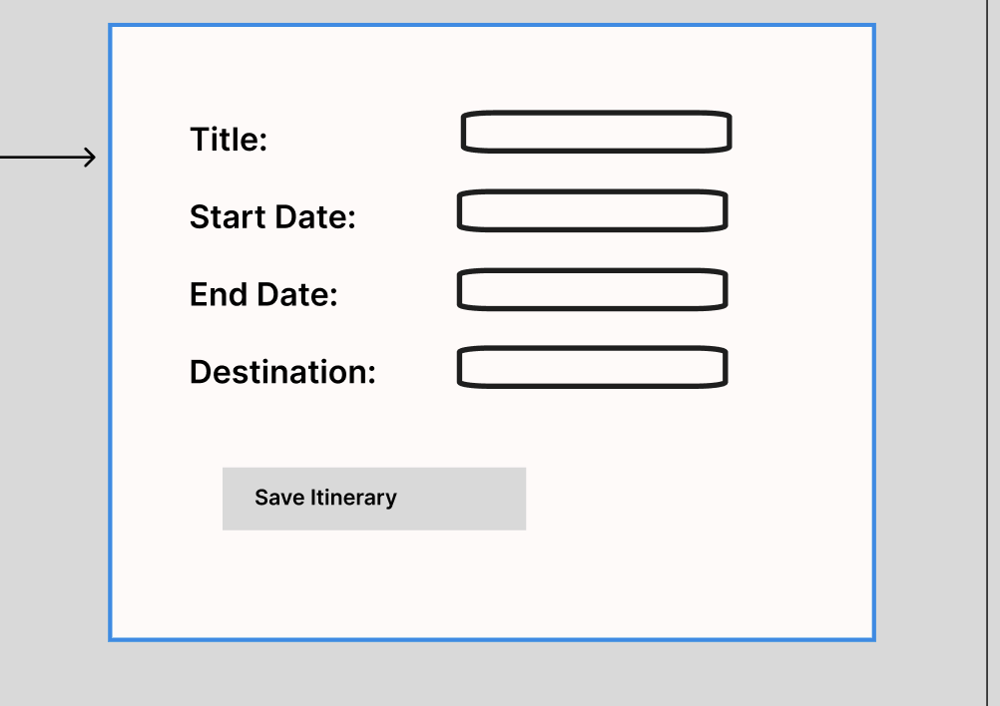
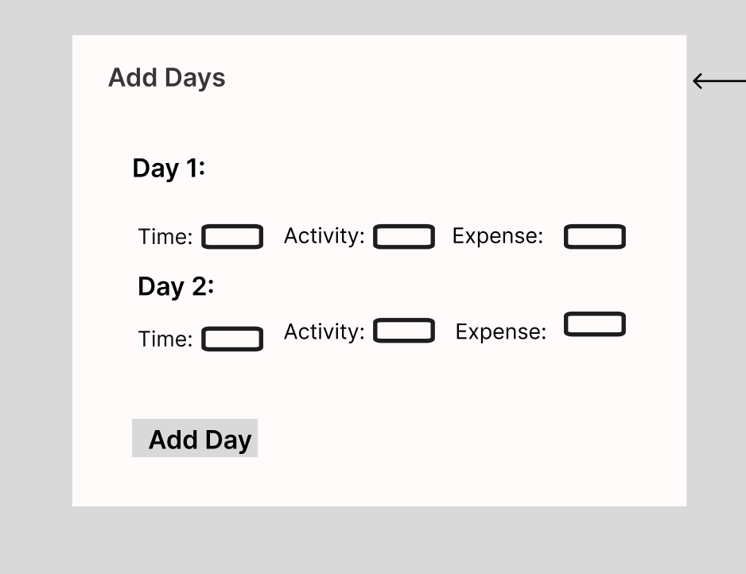

# Itinerary Planner

URL for deployed site 
---
([http://linserv1.cims.nyu.edu:27026/])

## Overview

The Itinerary Planner is a web application that allows users to create personalized travel plans. Users can add locations, schedule activities across multiple days, and input details like estimated time and cost for each activity. This app is designed to help travelers organize and manage their itineraries, ensuring they make the most of their trips.

## Data Model

User - Represents a registered user in the app.  
-Attributes: username, passwordHash, email 

Itinerary - Represents a user-created itinerary containing location, days, and user reference.  
-Attributes: title, startDate, endDate, user, destination 

Day: Contains daily activities linked to a specific itinerary.   
-Attributes: day 

Activity Document: Holds details like location, estimated time, and cost for a specific activity.   
-Attributes: name, startTime, endTime, location, expense 

An Example User: 

```javascript
{
  "username": "johnDoe",
  "passwordHash": "<hashed_password>",
  "email": "john@example.com",
}
```

An Example Itinerary

```javascript
{
  "title": "US Trip",
  "startDate": "20 Nov 2024",
  "endDate": "2 Dec 2024",
  "destination": "New York",
  "days": ["<Day1_ID>", "<Day2_ID>"],
 
}
```

## [Link to Commented First Draft Schema](config/db.js) 

## Wireframes
 

authorization and authentication - page for registering and logging in  


home - Home page displaying itineraries and you can create and delete itineraries here   
  

/create-itinerary - page for creating itineraries, create itinerary button on home page redirects to this page   
  

/create-day - page for creating day and then adding activities to it   
  


## Site map

/register - User registration page  
/login - User login page   
/itinerary-create - Page to create a new itinerary   
/itineraries/   
- home page displaying itineraries   
/itineraries   
/:id - going to a perticular itinerary    
/:id/delete - delete itinerary by id   
/:id/add-day - adding days to the itinerary  
/:id/day/add-activity - add activities to a perticular day   

## User Stories or Use Cases

1. As a non-registered user, I can register an account.
2. As a registered user, I can create and edit itineraries.
3. As a user, I can add activities to each day so that I can keep track of my schedule.


## Research Topics

* User Authentication (4 points): Implementing user authentication with Passport.js for secure login and access control.
* Frontend Framework (React.js) (5 points):
  Enables reusable UI components, speeding up development.
* ESLint Integration (2 points): 
  ESLint has been integrated into the workflow to maintain code quality and consistency, with a configuration file included in the repository. 
  This setup will automatically lint all JavaScript files on save, outside of node_modules. A screen capture showing the linting in action will be included.

## [Link to Initial Main Project File](app.js) 
